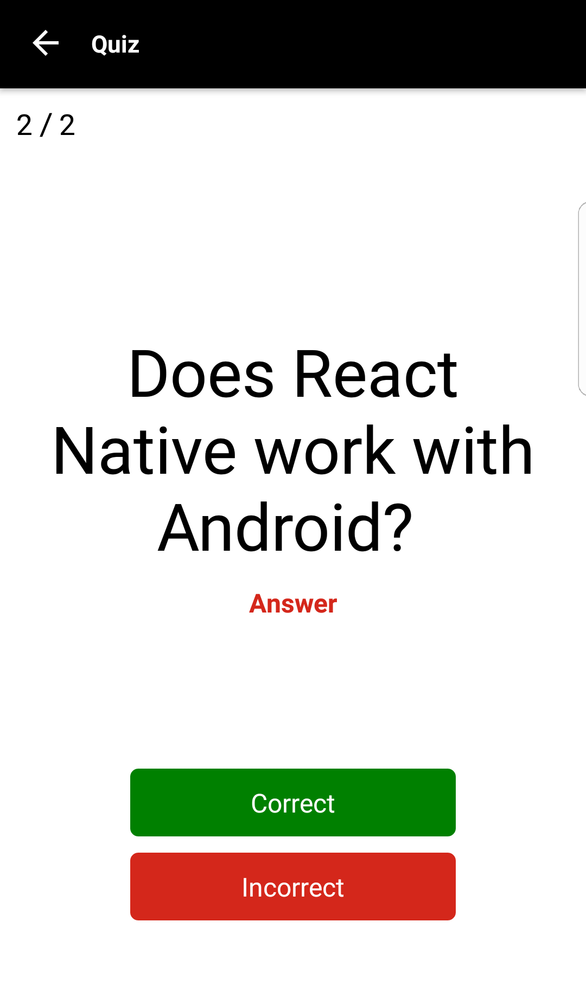
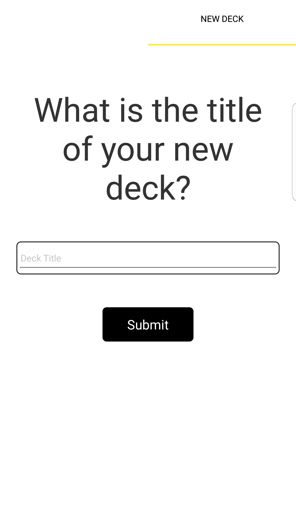

# UdaciCards Project

This is the final assessment project for Udacity's React Native course of [Learn React JS - React Nanodegree](https://www.udacity.com/course/react-nanodegree--nd019). This project encompasses the fundamental aspects of building an iOS and Android native application including handling lists, routing, and user input.

### Specific Requirements
- Use create-react-native-app to build your project.
- Allow users to create a deck which can hold an unlimited number of cards.
- Allow users to add a card to a specific deck.
- The front of the card should display the question.
- The back of the card should display the answer.
- Users should be able to quiz themselves on a specific deck and receive a score once they're done.
- Users should receive a notification to remind themselves to study if they haven't already for that day.

See [Project-Specification.pdf](./requirements/Project-Specification.pdf)

### Views
* Deck List View (Default View)
  - displays the title of each Deck
  - displays the number of cards in each deck


* Individual Deck View
  - displays the title of the Deck
  - displays the number of cards in the deck
  - displays an option to start a quiz on this specific deck
  - An option to add a new question to the deck


* Quiz View
  - diplays a card question
  - an option to view the answer (flips the card)
  - a "Correct" button
  - an "Incorrect" button
  - the number of cards left in the quiz
  - Displays the percentage correct once the quiz is complete



* New Deck View
  - An option to enter in the title for the new deck
  - An option to submit the new deck title


* New Question View
  - An option to enter in the question
  - An option to enter in the answer
  - An option to submit the new question


### Data

#### deck
```json
{
   id:"j9r67uop34t",
   title:"fun engilish words quizzes",
   timestamp:1509767253
}
```

#### card
```json
{
   id:"i8t36ytr9",
   question:"What did zero say to eight?",
   answer:"Nice belt. (The 8 looks like a 0 with a belt around its waist.)",
   deckId:"j9r67uop34t",
   timestamp:1509767253
}
```


#### Quiz
```json
{
   id:"op434fgt",
   deckId:"j9r67uop34t",
   score:90,
   start:1509767251,
   end: 15097689760,
   timestamp:1509767253,
   cards:{
     "i8t36ytr9":{
         correct: true,
         timestamp: 1509777995
       }
   }
}
```

### Create React Native App
This project was bootstrapped with [Create React Native App](https://github.com/react-community/create-react-native-app).

Below you'll find information about performing common tasks. The most recent version of this guide is available [here](https://github.com/react-community/create-react-native-app/blob/master/react-native-scripts/template/README.md).

### Runs the app in development mode.
```
yarn start
```

Open it in the [Expo app](https://expo.io) on your phone to view it. It will reload if you save edits to your files, and you will see build errors and logs in the terminal.

Sometimes you may need to reset or clear the React Native packager's cache. To do so, you can pass the `--reset-cache` flag to the start script:

```
yarn start -- --reset-cache
```

### Build standalone apk file
```
exp build:android
```

### Tested device
The app has been tested on Android phone:
- Model number: PLK-AL10
- Android version: 6.0

### Releases
[udacicards-1.0.apk](./release/udacicards-1.0.apk)

### Contributing

* Fork it!
* Create your feature branch: `git checkout -b my-new-feature`
* Commit your changes: `git commit -am 'Add some feature'`
* Push to the branch: `git push origin my-new-feature`
* Submit a pull request


### License

Copyright (c) 2017 Min Li

This program is free software: you can redistribute it and/or modify it under the terms of the Apache License Version 2.0 as published by Apache Software Foundation.
